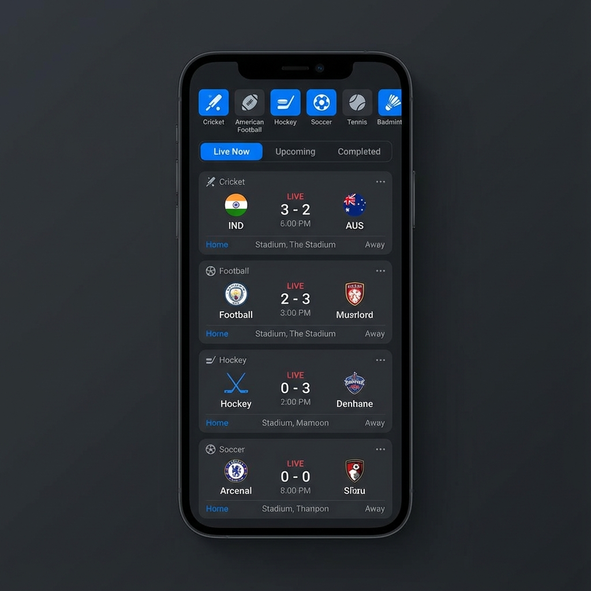
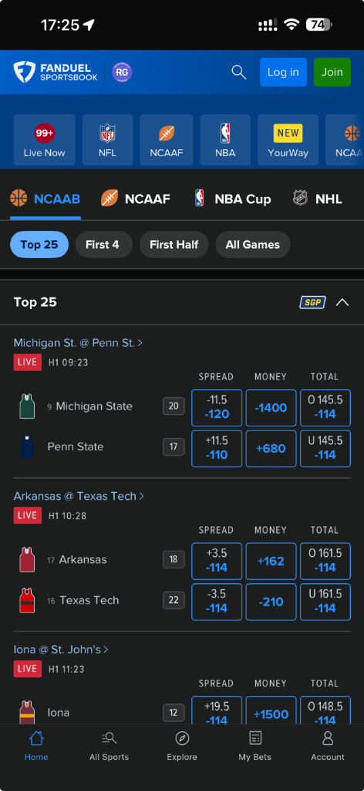

# Live Sports Score App - Design Proposal

## Overview
A cross-platform React Native application providing real-time sports scores across Cricket, American Football, Hockey, Soccer, Tennis, and Badminton.

## Design Prototype





## Proposed UI/UX Structure

### 1. **Primary Navigation (Top Level)**
- Horizontal scrollable tabs for each sport:
  - 🏏 Cricket
  - 🏈 American Football  
  - 🏒 Hockey
  - ⚽ Soccer
  - 🎾 Tennis
  - 🏸 Badminton

### 2. **Secondary Navigation (Sub-Level)**
Under each sport, categorized tabs:
- **Live Now** - Currently ongoing matches (default view)
- **Upcoming** - Scheduled matches
- **Completed** - Finished matches (last 24-48 hours)

### 3. **Match Card Components**
Each match displays:
- **Team Names & Logos** (or fallback icons)
- **Current Score** (Live updates)
- **Match Status** (Live indicator, time, period/inning)
- **Location/Venue** 
- **Home/Away Indicators** (H/A badges)
- **Additional Context**: League/Tournament name, match format (for cricket)

### 4. **Visual Design Elements**
- **Dark Theme** as primary (similar to reference)
- **Card-based Layout** for matches
- **Live Indicators** with red "LIVE" badges
- **Clean Typography** for scores (large, bold)
- **Accent Colors** - Blue primary, with sport-specific accent colors
- **Glassmorphism/Modern Styling** for premium feel
- **Smooth Animations** for tab transitions and score updates

---

## Technical Questions for Discussion

I need your input on the following technical architecture decisions:

### 1. **React Native Setup**
   - **Expo vs React Native CLI**: Would you prefer Expo (easier setup, faster development, managed workflow) or bare React Native CLI (more control, native modules)?
   - My **recommendation**: Expo with Custom Development Client for balance of ease and flexibility
   - **TypeScript or JavaScript**: TypeScript recommended for better type safety and testing automation

### 2. **Web Support**
   - React Native Web can render to browser, but requires additional configuration
   - Would you want a responsive web layout or mobile-first design that works on web?
   - Should web version be identical to mobile or have desktop-optimized layout?

### 3. **State Management**
   - **Redux Toolkit** (industry standard, robust)
   - **Zustand** (lightweight, simpler)
   - **React Query / TanStack Query** (excellent for API data fetching/caching)
   - My **recommendation**: React Query + Zustand (API state + app state separation)

### 4. **Navigation Library**
   - **React Navigation** (community standard)
   - **Expo Router** (file-based routing, newer)
   - My **recommendation**: React Navigation v6 (proven, stable)

### 5. **API Strategy & Data Sources**
   This is **CRITICAL** - Free sports APIs are limited. I've researched options:

   **Option A: Multi-API Approach (Recommended)**
   - **API-Sports** (RapidAPI) - Has free tier (100 requests/day) covering most sports
   - **TheSportsDB** - Free (limited live data, good for static info)
   - **ESPN Hidden API** - Free but unofficial, may break
   
   **Option B: Mock Data for Testing**
   - Start with realistic mock data
   - Plug in real APIs later
   - Best for your test automation use case
   
   **Option C: Build Simple Backend**
   - Aggregate multiple free sources
   - Cache responses to avoid rate limits
   
   **Which approach do you prefer?** For test automation, mock data might actually be ideal since it's predictable.

### 6. **Styling Approach**
   - **Styled Components** / Emotion
   - **NativeWind** (Tailwind for React Native)
   - **Vanilla StyleSheet** with theme system
   - My **recommendation**: Styled Components or custom theme system for consistency

### 7. **Testing & Automation Requirements**
   Since this is specifically for testing AI automation:
   - Should we add **testID** attributes to all interactive elements?
   - Do you need **Accessibility IDs** for Appium/Detox?
   - Should we implement **E2E test examples** (Detox, Maestro, Appium)?
   - Any specific **automation framework** you're targeting?

### 8. **Real-time Updates**
   - **Polling** (fetch every X seconds) - simpler
   - **WebSockets** - true real-time but more complex
   - **Push Notifications** - for background updates
   - For MVP, polling every 30-60 seconds likely sufficient

### 9. **Data Refresh Strategy**
   - Pull-to-refresh on all screens?
   - Auto-refresh while app is active?
   - Background fetch when app is backgrounded?

### 10. **Additional Features**
   - **Search/Filter** matches by team, league?
   - **Favorites** - save preferred teams/sports?
   - **Match Details** - tap card for detailed view (stats, lineups)?
   - **Notifications** - alerts for score updates?
   - **Share** - share match scores?

### 11. **GitHub & Project Structure**
   - Repository name preference?
   - **Monorepo** or separate repos for different platforms?
   - CI/CD pipeline (GitHub Actions for automated testing)?
   - Branch strategy (Git Flow, Trunk-based)?

### 12. **Development Environment**
   - Are you on **macOS** (for iOS development) or Windows/Linux?
   - Do you have **Xcode** and **Android Studio** installed?
   - **EAS Build** (Expo Application Services) for cloud builds vs local?

---

## Proposed Tech Stack (Pending Your Feedback)

```typescript
Core:
- React Native (with Expo)
- TypeScript
- React Native Web (for browser support)

State & Data:
- React Query (API data)
- Zustand (app state)

Navigation:
- React Navigation v6

Styling:
- Styled Components
- React Native Paper (component library)

APIs:
- API-Sports (RapidAPI) or Mock Data

Testing:
- Jest (unit tests)
- Detox (E2E automation)
- Accessibility testing tools

Deployment:
- EAS Build (iOS/Android)
- Vercel/Netlify (Web)
```

---

## Next Steps

Once you answer the key questions above, I will:

1. ✅ Create detailed implementation plan
2. ✅ Set up project structure with all configurations
3. ✅ Implement core navigation and routing
4. ✅ Build reusable component library
5. ✅ Integrate API data fetching
6. ✅ Add automation-friendly test IDs
7. ✅ Initialize Git repository
8. ✅ Create comprehensive README and documentation
9. ✅ Demonstrate working prototype

## Priority Questions (Please Answer)

**Most Important:**
1. **Expo or React Native CLI?**
2. **Real API data or Mock data** (for test automation predictability)?
3. **What automation tools** are you planning to test with this app?
4. **macOS available** for iOS development?

**Secondary:**
5. State management preference?
6. Should web version match mobile exactly or be responsive?
7. Do you want match details view or just list view?

Please let me know your preferences, and I'll create a complete implementation plan!
