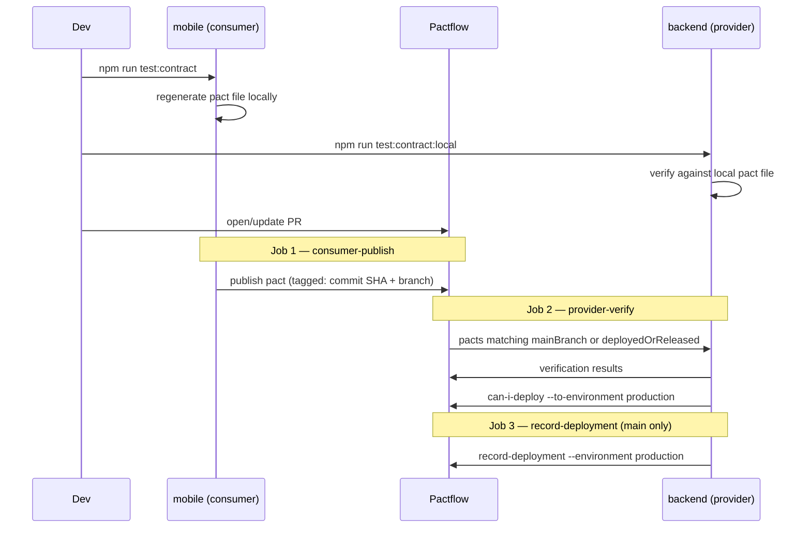

# Contract Testing

ScoreBook uses consumer-driven contract testing (via [Pact](https://pact.io) / [Pactflow](https://pactflow.io)) to protect the **mobile ↔ backend** boundary. This page covers what's actually wired up, when each piece runs, and what each command proves.

## Why this boundary, and why Pact

Mobile and backend live in the same repo, but they are **not** deployed on the same cadence:

- The backend redeploys to Vercel continuously, on every merge to `main`.
- The mobile app ships through app store review and can stay live in production for days to weeks after a backend change goes out.

That asymmetry is exactly the failure mode contract testing exists for: a backend change can break an old mobile build that's still out there, long after the backend's own tests went green. Pact catches that *before* the backend deploys, by checking the backend against what mobile actually expects — not just what the backend thinks it returns.

This currently covers `GET /api/health` and `GET /api/matches/:sport`. It does **not** cover the backend's integrations with third-party sports APIs (Cricbuzz, API-Football, etc.) — we don't own those providers, so there's no provider to run Pact verification against. That boundary needs a different technique (schema / bi-directional contract testing against recorded responses) and isn't built yet.

## Where things live

| Piece | Path | What it is |
|---|---|---|
| Consumer expectations | `mobile/pact/consumer/*.pact.spec.ts` | What mobile expects each endpoint to return, expressed with loose matchers (`like`, `eachLike`) so the contract doesn't over-specify exact values |
| Generated pact file | `mobile/pact/pacts/ScoreBookMobile-ScoreBookBackend.json` | The contract itself — regenerated from the consumer specs, committed to the repo |
| Provider verification (broker) | `backend/test/contract/verify.pact.test.ts` | Boots the real backend and checks it against pacts pulled from Pactflow. Requires `PACT_BROKER_TOKEN`. This is what CI runs. |
| Provider verification (local) | `backend/test/contract/verify.local.ts` | Same check, but against the pact file on disk instead of the broker. No token needed. |
| CI workflow | `.github/workflows/contract-tests.yml` | Publishes the pact, verifies it, gates deployment |

Provider verification always runs with `DATA_MODE=mock` forced on, so it checks against the committed fixtures deterministically — never against live RapidAPI calls, which would make the result depend on whatever matches happen to be live at that moment.

## The lifecycle

### 1. You change what mobile expects

Edit or add a spec under `mobile/pact/consumer/`, then:

```bash
cd mobile && npm run test:contract
```

This regenerates `mobile/pact/pacts/ScoreBookMobile-ScoreBookBackend.json` using Pact's own mock server. No token, no network call, nothing published anywhere yet.

### 2. Before you push

```bash
npm run test:contract:local   # from repo root
```

Boots the real backend against the pact file that was just regenerated, with no broker and no token involved. This answers "did my change break the contract as it's defined on my machine right now" — fast enough to run before every push. It does **not** know about contracts anyone else published that you haven't pulled locally; that's what CI is for.

### 3. You open or update a pull request

`.github/workflows/contract-tests.yml` triggers on `pull_request` (any base branch) or `push` to `main`. **Pushing to a feature branch on its own does nothing** — the workflow needs an open PR, or a push straight to `main`.



- **Job 1 — `consumer-publish`**: regenerates the pact (same `npm run test:contract`) and publishes it to Pactflow, tagged with the short commit SHA (consumer version) and the branch name.
- **Job 2 — `provider-verify`** (needs job 1): boots the backend and runs the broker-backed Jest test. It pulls back every pact matching `{ mainBranch: true }` **or** `{ deployedOrReleased: true }` — not just the one this PR just published — so a stale PR can't pass by only checking itself against itself. `enablePending: true` means a pact for an interaction the backend has never verified before is reported as *pending* rather than a hard failure, so introducing a new consumer expectation doesn't deadlock the first PR that adds it. Then it asks the broker directly: `pact-broker can-i-deploy --pacticipant ScoreBookBackend --to-environment production` — a second, independent gate based on the broker's own deployment-compatibility view, not just whether the Jest assertions passed.
- **Job 3 — `record-deployment`** (needs job 2, `if: github.ref == 'refs/heads/main'`): only runs on `main`, after a merge. Tells the broker "this backend version is now actually running in production" via `pact-broker record-deployment`. This is the fact that the *next* PR's `can-i-deploy` / `deployedOrReleased` selector relies on — if a merge to `main` doesn't actually make it to production (failed deploy, rollback), this step being skipped or wrong is how the broker's view of reality goes stale.

## Local vs. CI — different questions

| | Checks against | Needs the token? | Answers |
|---|---|---|---|
| `npm run test:contract:local` | Pact file on disk | No | "Did I just break the contract as currently defined here?" |
| `backend`'s `npm run test:contract` (CI) | Pactflow broker | Yes | "Is it safe to deploy, against every consumer version the broker currently knows about?" |

## Developer workflow

**Backend response shape is changing, and mobile already depends on the old shape** — update the consumer spec first (`mobile/pact/consumer/`), regenerate, run the local check against your backend change, confirm it fails for the right reason, then fix the backend to match (or decide the mobile expectation should change) before pushing.

**Adding a new endpoint mobile will consume** — add a new consumer interaction to an existing spec file (or a new one under `mobile/pact/consumer/`) alongside the happy path; consider a negative case too (ScoreBook's existing specs cover the sport-not-found 404, for example) — error shapes drift just as often as success shapes.

## Known limitations

- No `stateHandlers` are defined on the provider side yet. Every current interaction works against the static mock fixtures with no setup needed; a future interaction that needs specific backend state (e.g. "a match that's already completed") would need one.
- The local check only reflects the pact file on disk. It won't catch a new consumer expectation a teammate published to `main` that you haven't pulled yet — only CI's broker-backed selectors do.
- This only covers mobile ↔ backend. The backend's third-party sports API integrations (`backend/src/services/realDataService.ts`) have no contract coverage at all yet.
