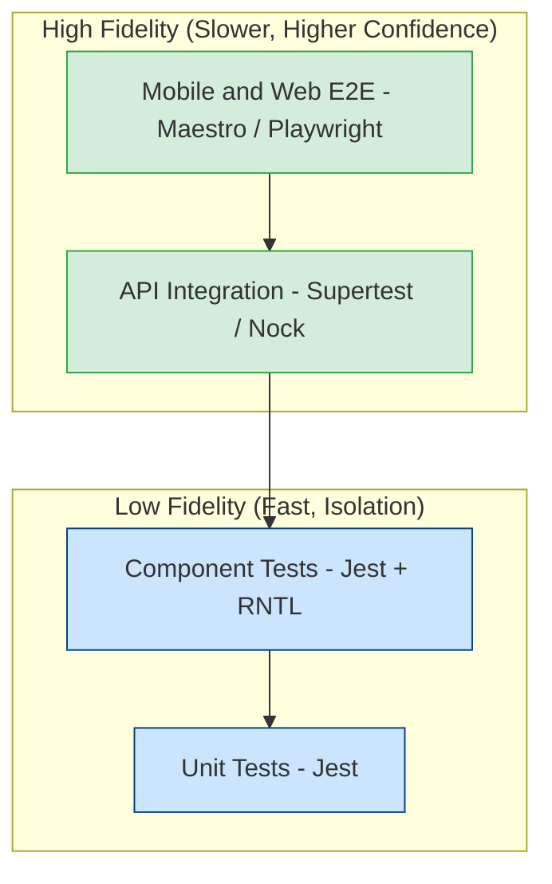
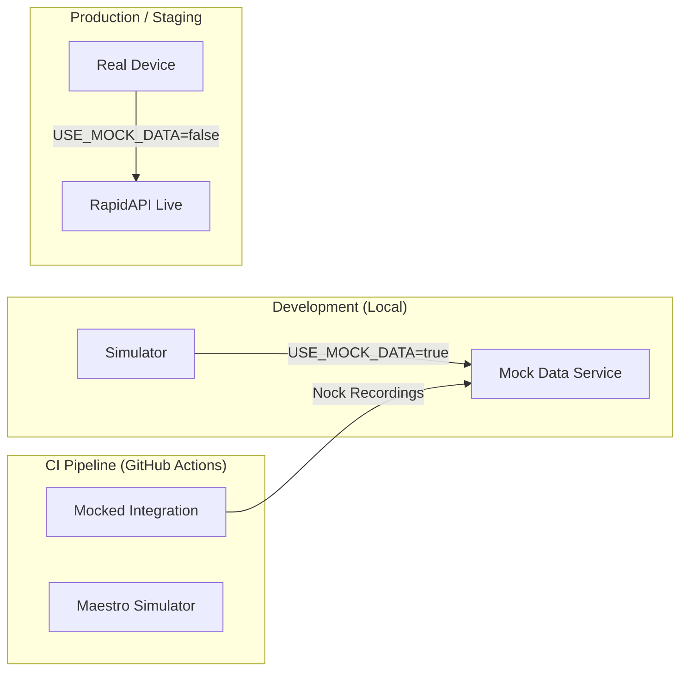

# ScoreBook Test Strategy

This document outlines the comprehensive testing strategy for the ScoreBook application. Our goal is to balance **developer velocity** with **release confidence** by using a layered testing approach.

## Core Philosophy

We adopt a **Dual-Layer** testing model for both Frontend and Backend:
1.  **Mocked Layer (Fast)**: Verifies logic, state management, and edge cases without external dependencies.
2.  **Integrated Layer (Realistic)**: Verifies critical user journeys and contracts using real (or high-fidelity) environments.



---

## 1. Frontend Strategy

### Mobile (React Native)

| Layer | Tooling | Purpose |
| :--- | :--- | :--- |
| **Unit / Component** | **Jest + RNTL** | Verifies logic and interaction. *Why RNTL?* It encourages testing how the user *uses* the app (tapping buttons, reading text) rather than implementation details. It does **not** rely on native rendering, making it instant to run. |
| **End-to-End (E2E)** | **Maestro** | Verifies the full app on Simulators (Dev) and Real Devices (Release). Treats the app as a "Black Box". |

### Web (React Native Web)

| Layer | Tooling | Purpose |
| :--- | :--- | :--- |
| **End-to-End** | **Playwright** | Ensures the web build renders correctly in standard browsers (Chrome, Safari) across different viewports. |

---

## 2. Backend Strategy (Node.js)

| Layer | Tooling | Purpose |
| :--- | :--- | :--- |
| **Unit** | **Jest** | Tests business logic, data transformers, and utilities in isolation. |
| **Integration** | **Supertest + Nock** | Tests the HTTP API surface. Uses `Supertest` to hit endpoints and `Nock` to record/replay RapidAPI responses, ensuring deterministic tests without incurring API costs. |

---

## 3. Test Suites & Frequency

We distinctly categorize tests to determine usually *when* they should run.

### 🔵 Smoke Suite (PR Check)
*   **Goal**: Ensure the branch is safe to merge. Fast feedback (< 10 mins).
*   **Scope**:
    *   Lint & Typecheck.
    *   100% Unit Tests (Frontend & Backend).
    *   Top 3-5 Critical User Flows (Maestro iOS Simulator).
    *   Mocked API Integration Tests.
*   **Trigger**: Open Pull Request.

### 🟣 Functional Regression (Nightly)
*   **Goal**: Catch regressions in deeper features or edge cases.
*   **Scope**:
    *   Full Maestro Suite (All features).
    *   Full Playwright Web Suite.
*   **Trigger**: Scheduled Nightly / Merge to `main`.

### 🟢 Release Suite (Pre-Production)
*   **Goal**: Final sign-off before App Store release.
*   **Scope**:
    *   Maestro running on **Real Devices** (via Cloud Farm or Local Device).
    *   Verifies performance and native behavior not captured by simulators.
*   **Trigger**: Release Tag / Manual Trigger.

---

## 4. Developer Guide: "What do I run?"

### "I am fixing a bug in a logic function..."
Run **Unit Tests**.
```bash
# Backend
npm run test:unit
# Frontend
npm run test
```

### "I am adding a new Screen..."
1.  Write **Component Tests** (RNTL) to verify the UI states (Loading, Error, Data).
2.  Add a **Maestro Flow** to verify navigation to/from this screen.
```bash
# Verify locally
maestro test .maestro/new-feature.yaml
```

### "I am modifying a Backend Endpoint..."
Run **Integration Tests**.
```bash
npm run test:integration
```

---

## 5. Environment Strategy


